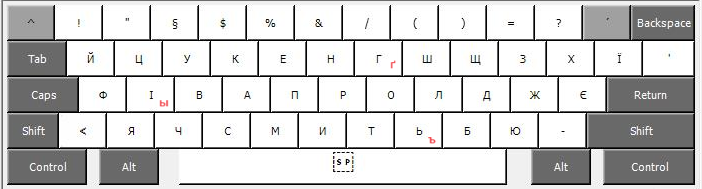
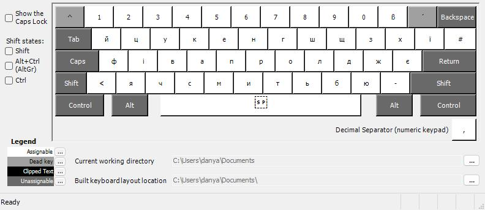
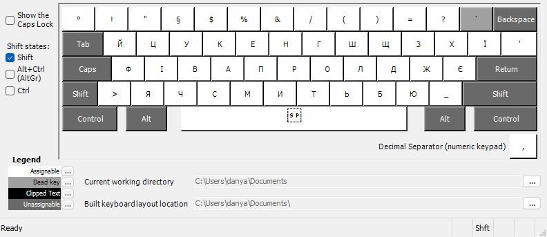
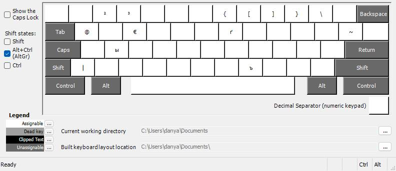
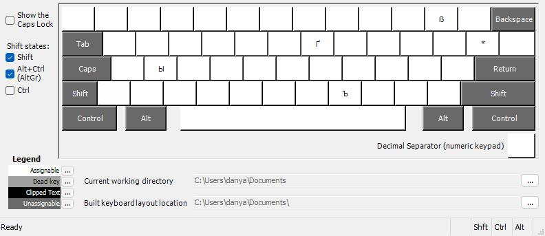
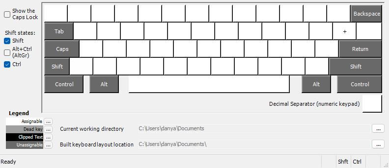

# Ukrainian + Russian QWERTZ Keyboard Layout for German Keyboards

This custom keyboard layout is designed for German QWERTZ keyboards, allowing you to type in Ukrainian and Russian seamlessly. The layout modifies certain keys for a more intuitive typing experience without confusion when switching between languages.

## Features
- **Ukrainian Layout**: Standard Ukrainian layout with adjustments to fit the QWERTZ layout.
- **Russian Letters**: Additional Russian letters on specific keys to make it easier to type in Russian without switching layouts.
- **Optimized for German QWERTZ Keyboards**: The layout keeps the standard German keyboard structure while adding Cyrillic characters where needed.

## Installation

To install the custom keyboard layout, follow these steps:

1.Download 
2.Install :)

Or

1. Download the  file and open it using [Microsoft Keyboard Layout Creator (MKLC)](https://www.microsoft.com/en-us/download/details.aspx?id=22339).
2. Build the layout using MKLC, which will generate an installer.
3. Run the installer to add the layout to your system.
4. Go to **Settings** → **Time & Language** → **Language**, and add the new layout under the **Preferred languages** section.
5. Switch to the new layout using the language bar or by pressing `Alt + Shift`.

## Preview

### Default Layer:

### Shift Layer:

### AltGr Layer:

### Shift + AltGr Layer:

### Shift + Ctrl Layer:

## Usage
This layout is ideal for users who frequently switch between Ukrainian and Russian while using a German QWERTZ keyboard. The additional Russian letters are placed in locations that minimize confusion and maintain a logical structure.

## License
This project is licensed under the MIT License - see the [LICENSE](LICENSE) file for details.
